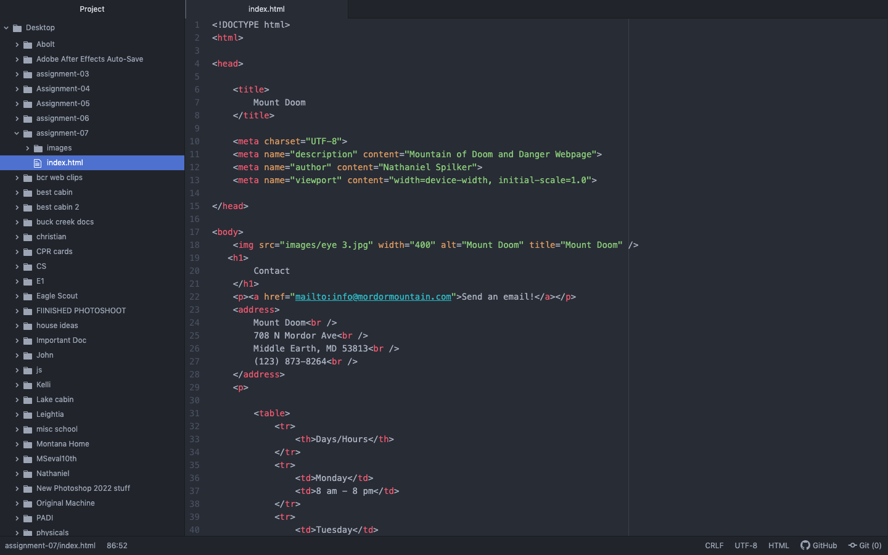

I have encountered many types of forms across the internet. One of the most common I run into is password inputs. This lets you input a password and enter certain sections of the website. Another common one is checkboxes. These let you check a box for many different reasons such as agree or disagreeing to a terms of service.

