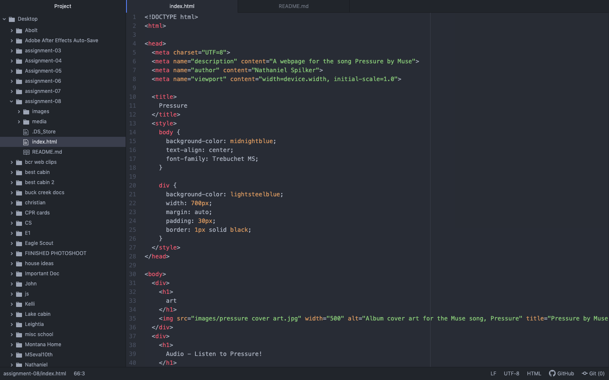

An affordance is the ability of a user to effect an object. It's the relationship between the object and the interact-or.
One of the advantages of using say Youtube to host videos is that it is easy to embed and add videos with this method. One of the downsides is that the videos can be copyrighted and won't play correctly when embedded.

