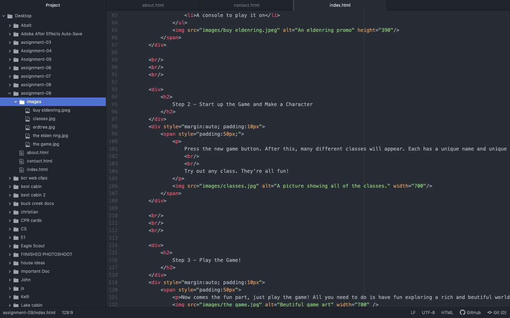

My experience with html was quite good. I actually took a coding class in a previous semester here which helped me greatly to understand the importance of html and how it works. Most of the information I have learned I already knew, but I did like using it in  a new way. I am both excited and nervous about CSS because I don't know how to use it. I'm excited for new information, but nervous of messing up future assignments. I stress pretty easily so I'm sure it's all in my head.

