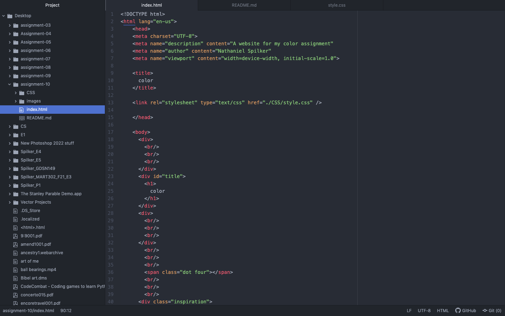

The ID attribute can only effect one element in html. The class attribute can effect multiple elements of the same type. The element attribute effects all elements that have the same attribute as itself. The universal attribute styles everything on a page. You would want to use universal for general changes, element to change a large group, class to change a smaller group, and ID to change a specific target.

I chose my colors based off of Vincent Van Gogh's famous painting titled Starry Night.

