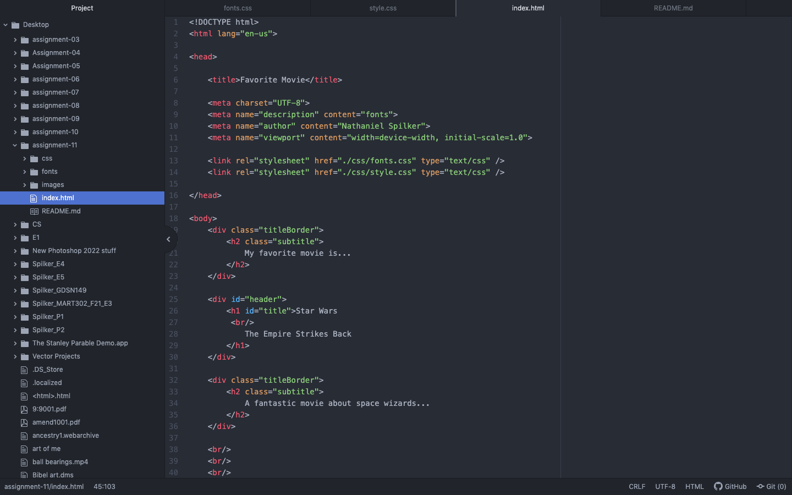

Typography is the art of how words look and how we as a creator can make them and change them to suit our needs.

It's important to have font families and stacks so that your text has the font you want. Fallback fonts ensure that even if the first font doesn't load properly, the next font will likely load.

System fonts are fonts already on your system but likely can't be used on the web. Web fonts are fonts on a server that require references on your system in order for said font to be called. Websfe fonts are fonts that are safe for both mac and windows and that can be found on your system while still being used on the web.

