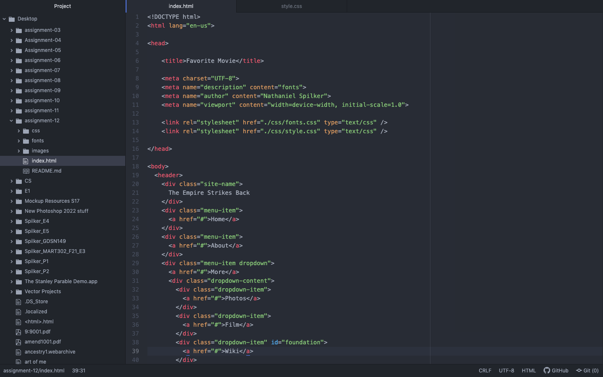

The margin is the space around an object's border. The padding is the space inside the border and the object itself. Essentially, the object is a photo, the padding is the wooden picture frame, the border is the edge of the frame, and the margin is the airspace around the picture frame.

